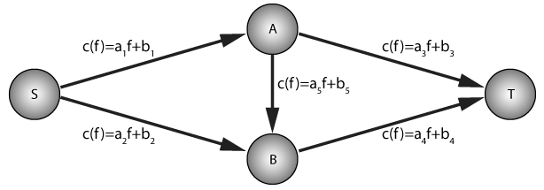

# netflows

This package finds optimal traffic assignment on networks to minimize total travel cost of all users, or estimates excessive travel cost due to lack of coordination if users choose their routes selfishly.

[](https://travis-ci.com/yingqiuz/netflows)

## Overview
Imagine we have a group of drivers transporting commodities from origin to a destination city. Each road is associated with a travel cost value (e.g. travel time spent on the road), which depends on the road's length, capacity, and the total traffic on it. Longer road length generally indicates higher travel cost, and so does lower capacity and more total traffic on the road, which increases the likelihood of a congestion. Without a global coordinator, each driver is only interested in minimizing his or her own travel cost. 

Here is an example:


One unit of infinitely divisible commodities are being transported from *S* to *T*. There are three possible paths, *S*-\>*A*-\>*T*, *S*-\>*B*-\>*T*, and *S*-\>*A*-\>*B*-\>*T*. Having the cost functions c(f) and real-time traffic in mind, drivers are under constant competition to choose the most efficient routes that minimize their own travel cost. 

How would you coordinate the traffic to minimize total travel cost of all the drivers? Or, if the global coordinator is absent, how to estimate the travel cost incurred by the selfish routing strategies of the drivers?

### System Optimal flow and Wardrop Equilibrium flow
A global coordinator seeks to minimize the total travel cost of all the drivers, namely, the total cost of transporting all the commodities from origin to destination. Fortunately, if the cost functions are convex, the total travel cost always has a global minimum. Our package can help you find the optimal traffic assignment and estimate the associated travel cost on each road and in total! You can also alter the network (i.e., adding an edge) and see how the assignment or the travel cost goes.

However, in the absence of global coordination, drivers choose their routes selfishly, only interested in minimizing their own travel cost. Then it comes to the term, Wardrop Equilibrium, which is a type of Nash Equlibrium of the drivers' competition in finding the most economic routes. At Wardrop Equilibrium, "The journey times on all the routes actually used are equal, and less than those which would be experienced by a single vehicle on any unused route" \[Wardrop 1952\]. The Wardrop Equilibrium flow is not optimal in the sense of global travel cost due to lack of coordination, but it is useful in estimating the real-time traffic flow and cost, and in designing new road networks (as the selfish routing strategies may lead to Braess's paradox, in which adding extra road to alleviate congestion will actually increase the total travel cost).

### Path formulation and edge formulation
At this point, it will be useful to clarify several terms, path formulation and edge formulation of traffic flow. Suppose a total of *f* commodities has to be transported from source *s* to target *t* on a graph and  is the set of all possible paths from *s* to *t*. In path formulation,  is the flow on path  for  therefore we have .

### Choice of cost functions

## Install
Make sure you have Python>=3.5 installed. To install this package, open a terminal and type the following:

```shell
git clone https://github.com/yingqiuz/netflows.git
cd netflows
python setup.py install
```

## Examples

### find all possible paths
To find all paths that are shorter than k steps (i.e., binary distance) from a source node *s* to a target node *t*, run the following:
```python
from netflows import Graph

# create the Graph object
G = Graph(adj=adjacency_matrix, dist=distance_matrix, weights=weight_matrix)
# find all possible paths below k steps from source node s to target node t
allpaths = G.findallpaths(s, t, cutoff=k)
``` 
`allpaths`is  a list of all the possible paths from *s* to *k* shorter than *k*. Each element is a list storing the nodes' indices in the order that the users traverse from *s* to *t*. **NB**: in the adjacency/distance/weight matrix, element *i, j* denotes the directionality from *i* to *j*.

### find shortest paths
To find the shortest path from *s* to *t*:
```python
d = G.dijkstra(s, t)
```
which returns the binary shortest distance from *s* to *t*, or the weighted version:
```python
d = G.dijkstra_weighted(s, t)
```

### System Optimal flow
To find the system optimal flow assignment that minimizes the total travel cost of all the network users:
```python
from netflows import system_optimal_linear_solve

# find the optimal flow assignment and the total travel cost
flows_path_formulation, flows_edge_formulation, total_travel_cost, edge_travel_cost = system_optimal_linear_solve(G, s, t, tol=1e-8, maximum_iter=100000, cutoff=k)
```
`flows_path_formulation` is a list of flows corresponding to the elements in `allpaths`. `flows_edge_formulation` is a matrix with element *i, j* storing the flow on edge *(i, j)*. `total_travel_cost` is the total travel cost incurred by all the users (a scalar value), and `edge_travel_cost`is a matrix with element *i, j* storing the travel cost on edge *(i, j)* incurred by the users that traverse this edge.

Also supported: `system_optimal_affine_solve`, `system_optimal_bpr_solve`.

### Wardrop Equilibrium flow
To estimate the travel cost due to lack of coordination (i.e., to find the Wardrop Equilibrium flow):
```python
from netflows import wardrop_equilibrium_linear_solve

# find the WE flow assignment and the total travel cost
flows_path_formulation, flows_edge_formulation, total_travel_cost, edge_travel_cost = wardrop_equilibrium_linear_solve(G, s, t, tol=1e-8, maximum_iter=100000, cutoff=k)
```
Likewise, `flows_path_formulation` is a list of flows corresponding to the elements in `allpaths`. `flows_edge_formulation` is a matrix with element *i, j* storing the flow on edge *(i, j)*. `total_travel_cost` is the total travel cost incurred by all the users (a scalar value), and `edge_travel_cost`is a matrix with element *i, j* storing the travel cost on edge *(i, j)* incurred by the users that traverse this edge.

Aso supported: `wardrop_equilibrium_affine_solve`, `wardrop_equilibrium_bpr_solve`.

## Contributing
We welcome all bug reports, suggestions and changes! If you are interested in getting involved, please refer to for the guidelines, fork the repository on GitHub, and create a pull request.
